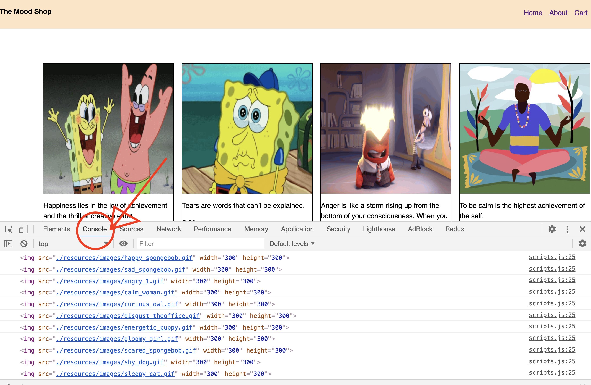

# Displaying Moods

This chapter will focus on displaying all moods on our page. Currently our page has only a navbar. 

At the end of this chapter, we will be able to have something like this. 


The first thing we need are the images to display for each mood. 

>[action] Download the images folder from here ***(provide link to download)***

>[action] Save this image folder in your project inside the folder /resources. So -ecommerce/resources/images

The next thing we will need to do is get the json data that holds all the information about each mood including the name, image url, description and price. 

The json data that we will be using is located in data.js file. 

>[action] Download this file from here ***(enter link that directs to download)***

Now navigate to your resource folder. 

>[action]Inside your resource folder, create another folder named js. This folder will hold all your .js files including javascript and JSON files. 

>[action]Move the ```data.js``` file you downloaded to the js folder.  

If you open your ```data.js``` file, you will see an array of JSON data. 

```js
const data = [{
  "id": 1,
  "name": "happy",
  "image": "./resources/images/happy_spongebob.gif",
  "desc": "Happiness lies in the joy of achievement and the thrill of creative effort.",
  "price": 5.99
}, {
  "id": 2,
  "name": 'sad',
  "image": './resources/images/sad_spongebob.gif',
  "desc": "Tears are words that can’t be explained.",
  "price": 5.99
}
...
```

# What exactly is a JSON data? 🤔

AKA Java Script Object Notation

A JSON object contains data in the form of key/value pair
The key and value pairs are separated by a colon(:). Located left of the colon is the key and on the right is it’s value. 

Here are a few links to learn more about json objects.

[Intro to JSON](https://www.copterlabs.com/json-what-it-is-how-it-works-how-to-use-it/) - the first few chapters gives a good introduction to JSON

[JSON example](https://www.javatpoint.com/json-example), 
[JSON short Tutorial](https://restfulapi.net/introduction-to-json/) 

Now that we have a good understanding of JSON, we can better understand what the file we are looking at is. The ```data.js``` file contains an array of objects. Each object contains the data for each mood to be displayed. This data consists of **id, name, image, price** and **description** as a **key:value** pair. 

>[action] Below our header element in our index.html file, let’s add another element called main.
This will hold all the mood items. 

```html
<main class='items' id='items'>
    <!-- 
      Display moods here
     -->
</main>
```

We will be using javascript to dynamically display all the items for the mood shop. We will use a **for loop** to loop through each object inside the ```data.js``` array and assign image as the image source tag, description as the paragraph to describe the image and price to show the price for each mood. 

>[action] Navigate to the js folder (ecommerce/resources/js). Create a new file called scripts.js. This file will hold all your javascript logic to display the items, and future steps like adding them to the cart and removing them from the cart. 

>[action] Open the scripts.js folder. 
First we need to get the reference to the containers where all the items will be in. 

All items will be in the main tag. The main tag has an id of ‘items’. We can get this element using its id name. Inorder to do this, we can use the document.getElementbyID function. Then pass the function the id name of the element.

>[action] Add this at the top of your ```script.js``` file
const itemsContainer = document.getElementById('items')

We also need to import the json file into the ```script.js```. 

>[action] Add this import statement at the top of your script.js file. (Line 1)
```import data from './data.js'```

Now that we have access to the json array, we can loop through the array and make image elements out of it.

If you open ```data.js``` and see the image **keys:values** pair, the values is a reference to the source file of corresponding mood gifs located in the images folder. We will be using these values in the img src tag to display the images.

Now let’s loop over each element inside each object and display their images. 

[How to create an element in javascript](https://developer.mozilla.org/en-US/docs/Web/API/Document/createElement) 

```js
for (let i=0; i<data.length; ++i) {
let newDiv = document.createElement('div');
 	newDiv.className = 'item'

 	 // display the image
  let img = document.createElement('img');
  img.src = data[i].image
  img.width = 300
  img.height = 300
  newDiv.appendChild(img)
  console.log(img)
}
```

>[info] Here we are looping through each object and for each of them, we create a div element first.
```js
let newDiv = document.createElement('div');
```
This will create an html div element. 
```html
<div> </div>
```

Second line assigns a class name to the div we just created
```js
newDiv.className = 'item'
```
```html
<div class=’item’> </div>
```

We want this div we created to hold the image, description and price of each item. 
Let’s start with the image.
We can create the image tag using ```document.createElement(‘img’)```
```js
let img = document.createElement('img');
```

>[info]Each attribute that we want to add to the image could be added using ```img.attributeName```

>[action]Add the src, width and height of the image.
```js
img.src = data[i].image
img.width = 300
img.height = 300
```


```console.log``` is a way to print our progress. Once we make the image, we are printing it to the console to see if it's being created. It is a good way to make sure if your code is working the way it's supposed to. 
On your browser, right click and select inspect element. Navigate to console. You should see image tags. 



